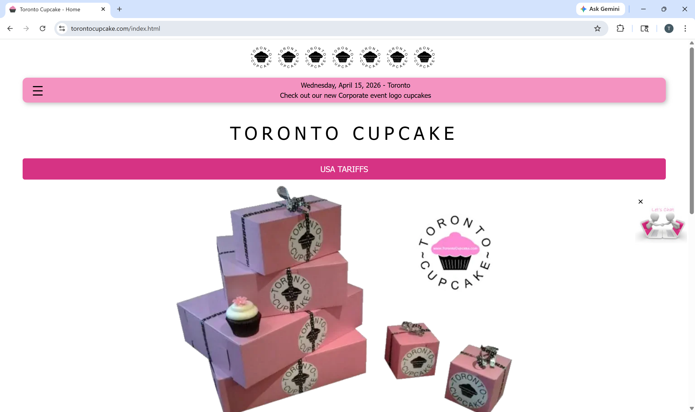
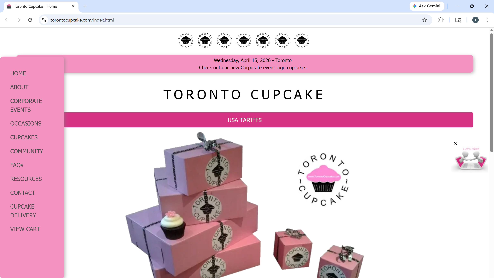
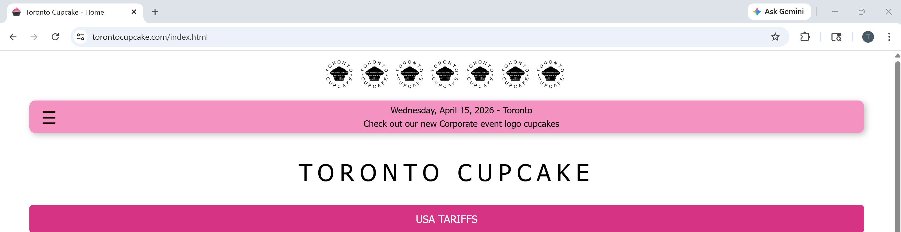
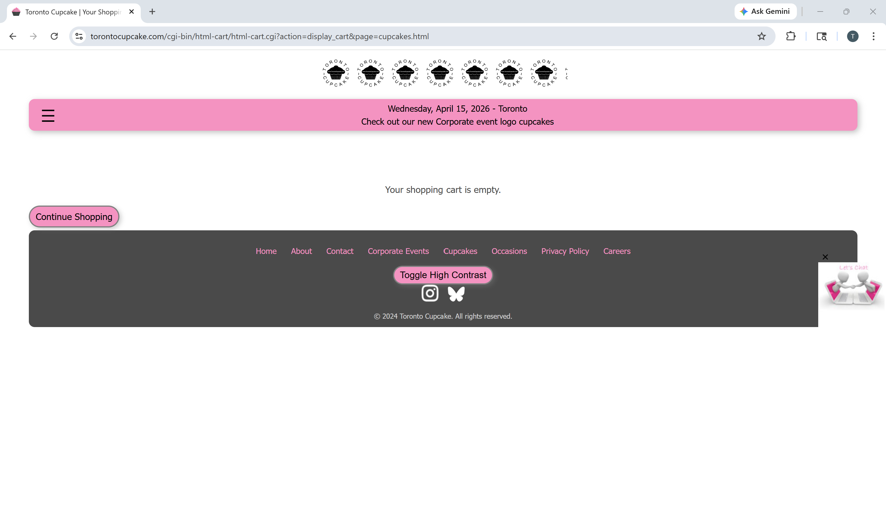
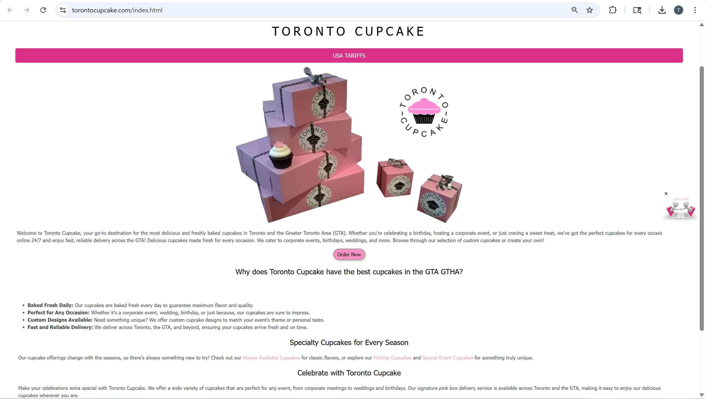

# Overview of Project 📕

## Group Project: Toronto Cupcake UX Website Redesign

## Website Chosen

Although I am not enrolled in ACIT 2811, I am grouped with Anna and Ava, who are taking the course. Our team selected Toronto Cupcake as the website for our UX redesign project.

!!! info "Project Context"
    This project focuses on analyzing and redesigning the Toronto Cupcake website using UX and UI principles to improve usability, navigation, and visual design.

Toronto Cupcake is a well-established business that specializes in gourmet cupcakes for holidays, corporate events, weddings, and large celebrations. The company has strong brand recognition and a clear product offering. However, the current website does not reflect the quality of the brand. The design feels outdated and cluttered, making it difficult for users to navigate, find products, and complete purchases efficiently. This makes Toronto Cupcake an ideal candidate for a UX-focused redesign.

---

## Why We Chose This Topic

We chose Toronto Cupcake because it clearly demonstrates how poor UX and visual design can negatively impact user trust and engagement, even when the business itself is strong.

The website lacks polish and professionalism despite having a recognizable brand. Its navigation is confusing and does not follow common usability conventions, which makes it difficult for users to find important information. In addition, the visual hierarchy is weak, so users may struggle to identify key actions or content. The overall design also does not align with the expectations of customers planning upscale events, which reduces perceived quality. At the same time, the core content of the business is strong, which creates a valuable opportunity to improve usability without changing the actual products or services.

This project allows us to explore how thoughtful UX and UI improvements can enhance user experience and strengthen brand perception.

!!! warning "Key UX Issue"
    Poor navigation and cluttered layout may cause users to leave the site before completing a purchase.

---

## Areas Selected for Redesign (Team Focus)

As a team, we identified several major UX and UI issues and focused on improving key areas of the website.

### Navigation Structure

The current navigation is cluttered and difficult to scan, which makes it harder for users to locate important pages such as the shop, cart, and ordering information. This lack of clarity can slow down user interactions and create hesitation when navigating the site. Our redesign focuses on creating a simplified, horizontal navigation menu with clear and familiar labels to improve usability.

---

### Visual Hierarchy

The current design lacks a strong visual hierarchy, as headings, images, and calls to action compete for attention. This makes it difficult for users to know where to focus first. The redesign will improve this by using consistent typography, better spacing, and a more structured layout to guide the user’s attention naturally.

---

### Shop and Cart Experience

The current imagery does not support the “gourmet” positioning of the brand, which affects how users perceive the quality of the products. In the redesign, higher-quality visuals and consistent branding will be used to create a more premium and appealing experience. This helps build trust and encourages users to make purchasing decisions.

---

### Content Organization

Information on the website is currently scattered and overwhelming, making it difficult for users to find what they need. The redesign will focus on organizing content into clear, goal-oriented sections that support easy navigation and reduce cognitive load.

!!! danger "Impact on Users"
    Poor content organization and unclear structure can lead to frustration, reduced trust, and abandoned purchases.

---

## My Individual Contributions

While working collaboratively with the team, my individual focus has been on visual and UX analysis. I contributed by conducting a visual design critique of the existing website and identifying layout issues such as inconsistent spacing and clutter. I also analyzed how the design does not align with the expectations of the target audience and provided UX-focused recommendations to improve clarity, usability, and overall flow. In addition, I suggested accessibility and readability improvements while maintaining the brand identity.

---

## What I Hope to Gain From This Class

Through this course and project, I hope to develop a stronger understanding of usability principles and UX heuristics. I also aim to gain hands-on experience with real-world redesign problems and improve my ability to analyze and critique designs from a UX perspective. In addition, I want to learn how to apply UX principles in practical scenarios and strengthen my teamwork and communication skills.

!!! info "Learning Outcome"
    This project helps connect UX theory with real-world design challenges.

---

Overall, this project is helping me better understand how design choices directly affect user experience, brand perception, and usability.
