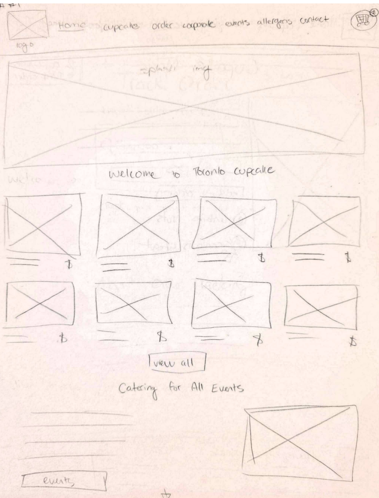
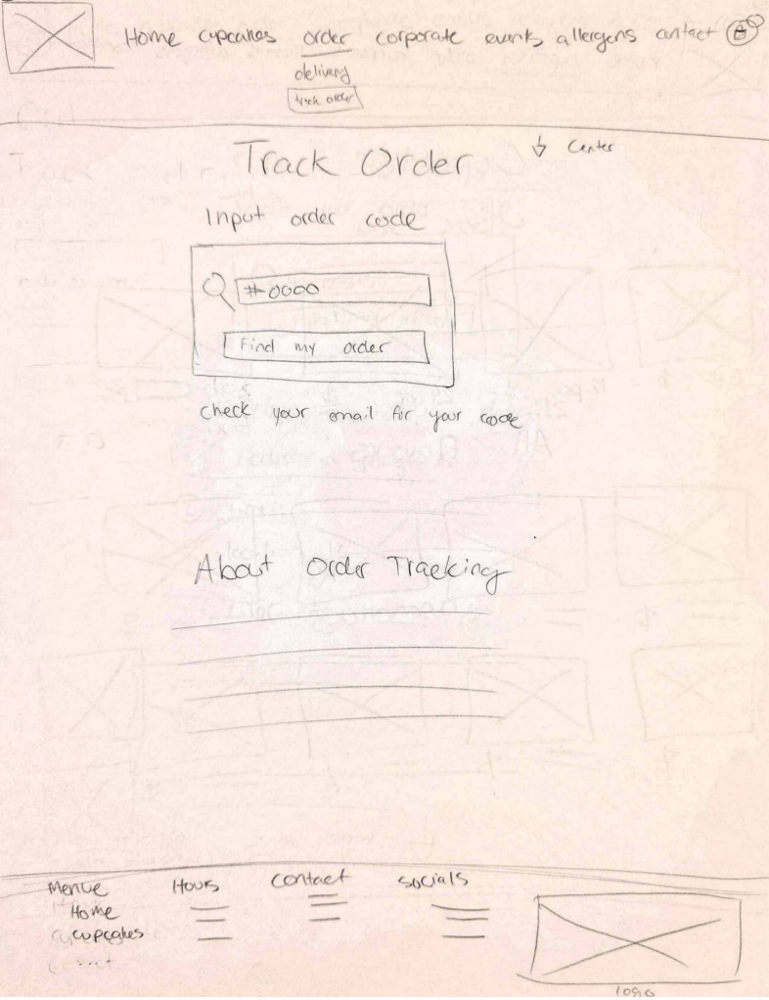
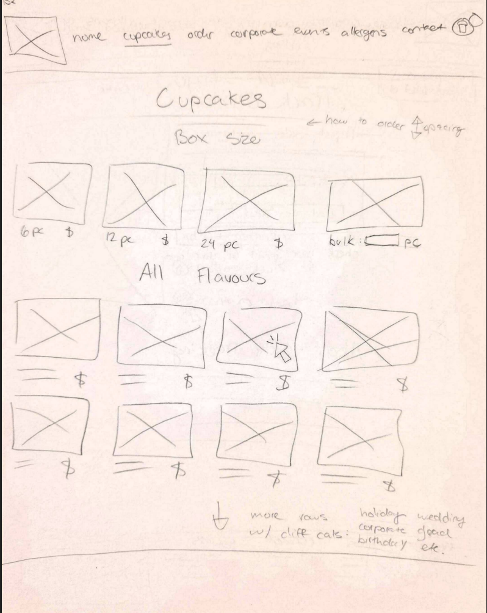
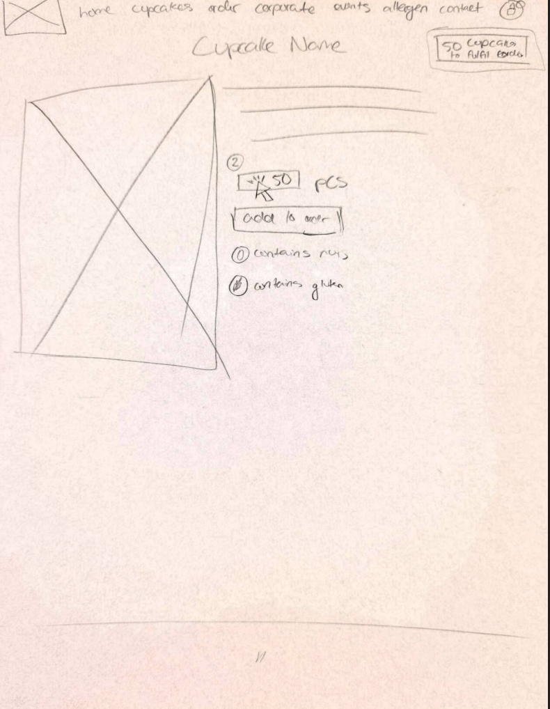
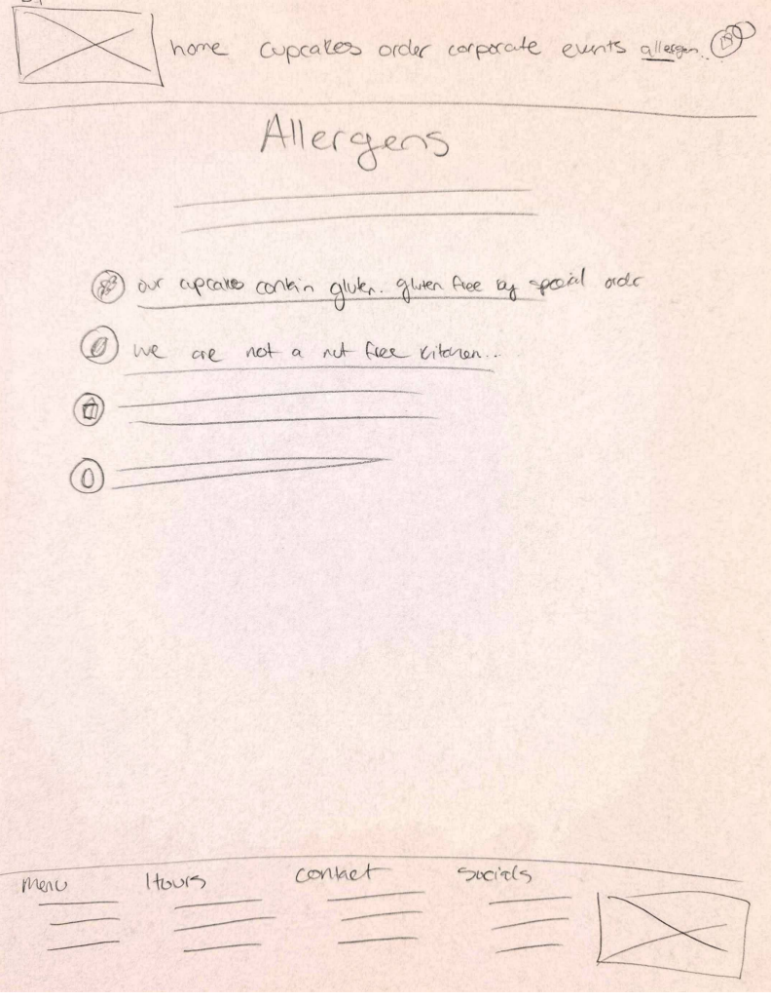
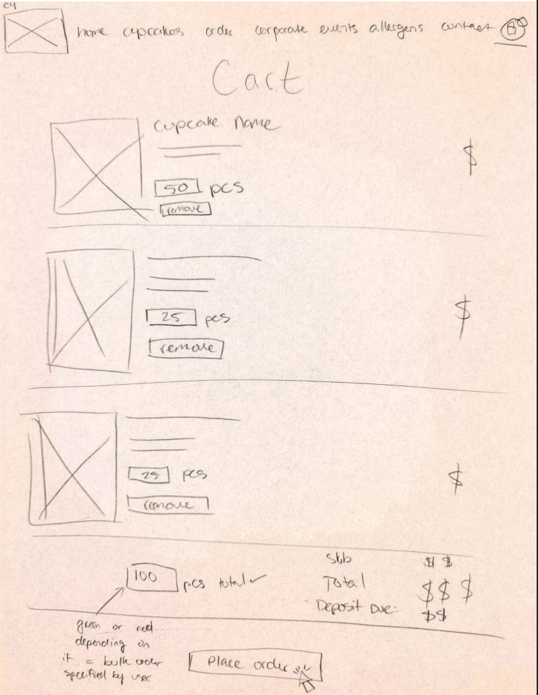
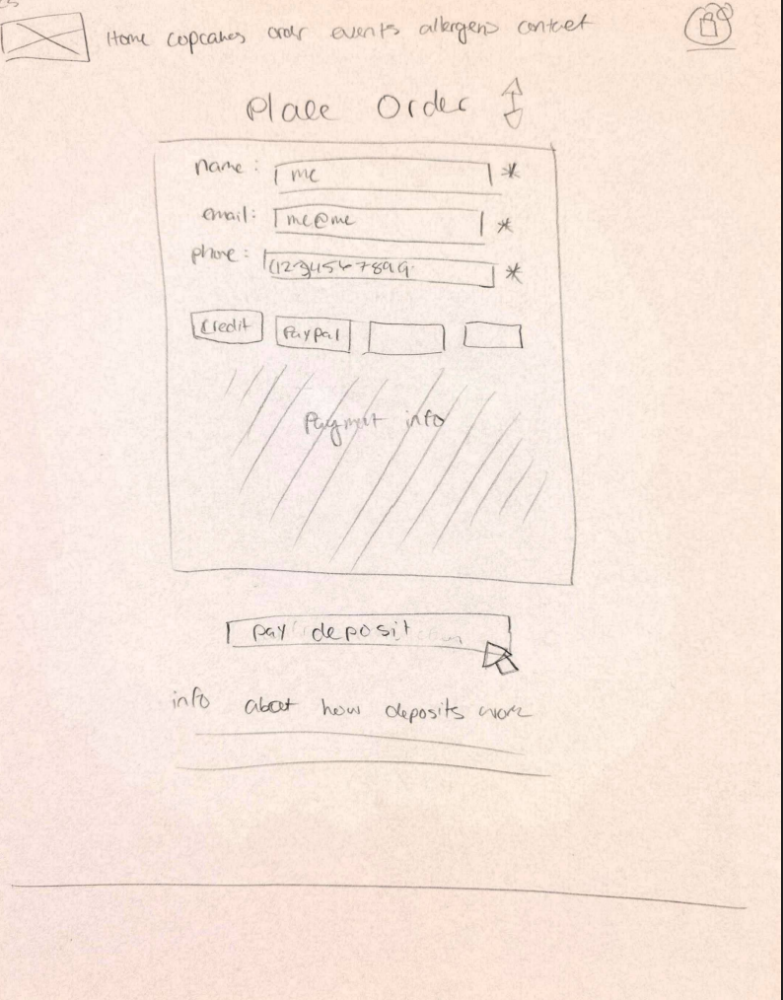
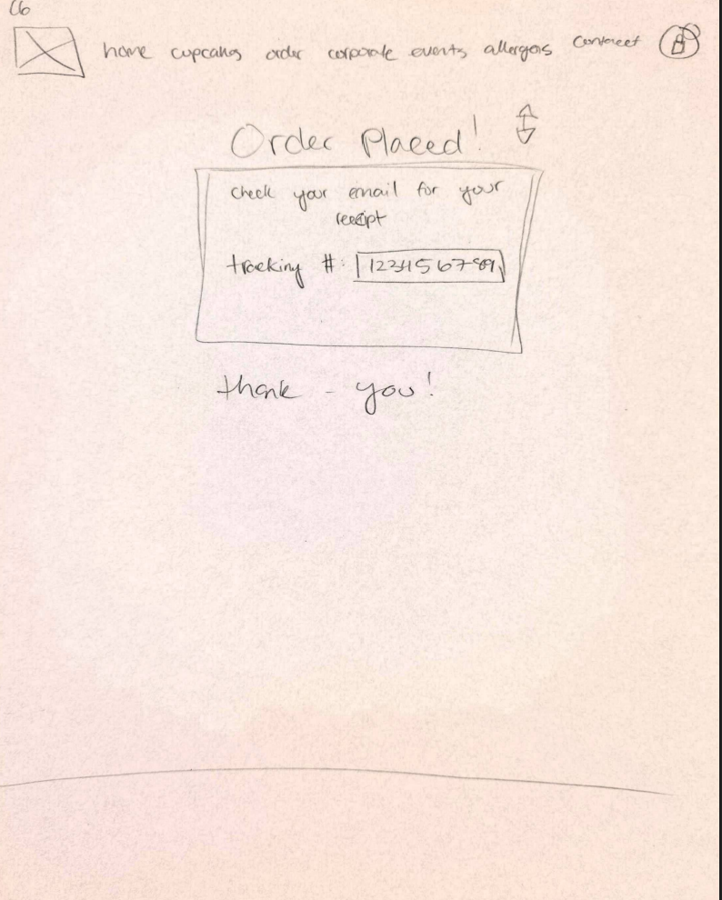

# Low-Fidelity Wireframes 📒

The low-fidelity (LowFi) wireframes represent the early stage of the Toronto Cupcake website redesign. At this stage, the primary focus is on defining the layout, improving navigation, and organizing user flows in a clear and logical way. These wireframes do not include visual styling such as colors or fonts, but instead emphasize usability and structure. By focusing on functionality first, it becomes easier to identify potential usability issues and improve the overall user experience before moving into more detailed design stages.

!!! info "Purpose of LowFi Wireframes"
    LowFi wireframes are used to quickly explore layout ideas and test how users interact with the system. They help designers focus on structure and usability without being distracted by visual details.

!!! warning "Design Limitation"
    These wireframes do not include final visual elements such as branding, typography, or colors. Their purpose is to focus strictly on usability, layout, and content organization.

---

## Homepage Layout

The homepage is designed to provide users with a clear and structured introduction to the website. It includes a top navigation bar, a hero banner, and a grid of featured cupcakes. The navigation bar contains key sections such as Home, Cupcakes, Order, Corporate, Events, Allergens, and Contact, allowing users to easily move between different parts of the site. The featured cupcakes are displayed in a grid layout, which supports quick scanning and helps users visually browse available products. A “View All” button is included to encourage users to explore more items in the catalogue.

This layout improves the user experience by presenting information in a clean and organized way. Users can quickly understand where to go and what actions they can take, which creates a positive first impression and reduces confusion when entering the site.

---

## Track Order Page

The track order page is designed to give users a simple and efficient way to check the status of their orders. Users are able to enter their order number into an input field and click a button to retrieve their order details. Once submitted, the system displays relevant information such as the order status and summary.

This design helps reduce user frustration by providing a clear and direct method for tracking orders. Instead of navigating through multiple pages or contacting support, users can quickly access the information they need. This improves overall usability and increases user confidence in the system.

---

## Cupcakes Catalogue Page

The cupcakes catalogue page organizes products based on box sizes and flavors, allowing users to browse items in a structured and meaningful way. Users can select from different quantities such as 6, 12, 24, or bulk orders, and each cupcake is displayed in a grid layout with pricing information clearly shown.

This organization improves the browsing experience by making it easier for users to compare options and understand pricing at a glance. In the original website, product organization was unclear, which made it difficult for users to navigate. This redesigned layout addresses that issue by providing a clearer structure and improving readability.

!!! warning
    Clear product organization is essential, as confusion at this stage can prevent users from continuing with the ordering process.

---

## Product Details Page

The product details page provides users with more information about a selected cupcake. It includes a product image, a quantity selector, and an “Add to Order” button. In addition, allergen information is displayed clearly within the product description, helping users understand any potential dietary concerns.

This page supports informed decision-making by presenting all necessary information in one place. Users can confidently select items knowing that important details, especially allergen information, are visible and accessible.

!!! danger
    If allergen information is missing or unclear, it can create serious risks for users with dietary restrictions.

---

## Allergens Page

The allergens page provides a centralized location for all allergy-related information. It includes details about gluten-free options as well as warnings about possible cross-contamination. This page is designed to be easy to access so users can quickly find important health-related information.

Providing a dedicated allergens page improves transparency and builds trust with users. It ensures that users do not have to search through multiple pages to find critical information, which enhances both usability and safety.

---

## Cart Page

The cart page allows users to review their selected items before completing their order. It displays product names, quantities, and pricing details, along with options to remove items if needed. The total price and deposit information are clearly shown, and a “Place Order” button guides users to the next step.

This design helps users feel more in control of their purchase by clearly presenting all relevant information. It also reduces the likelihood of errors, as users can easily review and modify their selections before proceeding.

!!! warning
    If cart details are unclear or difficult to edit, users may abandon their purchase before checkout.

---

## Checkout Page

The checkout page is one of the most important parts of the user experience, as it is where users finalize their order. The page includes a form where users enter their name, email, and phone number, along with payment information. A “Pay Deposit” button clearly indicates the final action required to complete the purchase.

This layout is designed to be simple and easy to follow, reducing cognitive load and helping users complete the process without confusion. A clear and straightforward checkout experience increases the likelihood of successful transactions.

!!! danger
    A complicated or unclear checkout process can result in lost sales and user frustration.

---

## Order Confirmation Page

The order confirmation page provides feedback to users after they have successfully placed an order. It includes a confirmation message, an order tracking number, and a reminder that details will be sent via email.

This page is important because it reassures users that their order has been completed successfully. It also provides clear next steps, such as tracking the order, which improves the overall user experience.

!!! info
    Clear confirmation messages help build trust and ensure users feel confident in their actions.

---

## Summary of Design Improvements

The LowFi wireframes address several key usability issues found in the original website. By improving navigation, organizing products more clearly, simplifying the checkout process, and increasing the visibility of important information, the redesign creates a more user-friendly experience.

Overall, these wireframes provide a strong foundation for the final design. They focus on making the website more efficient, intuitive, and trustworthy, which will lead to a better experience for users when interacting with the system.
