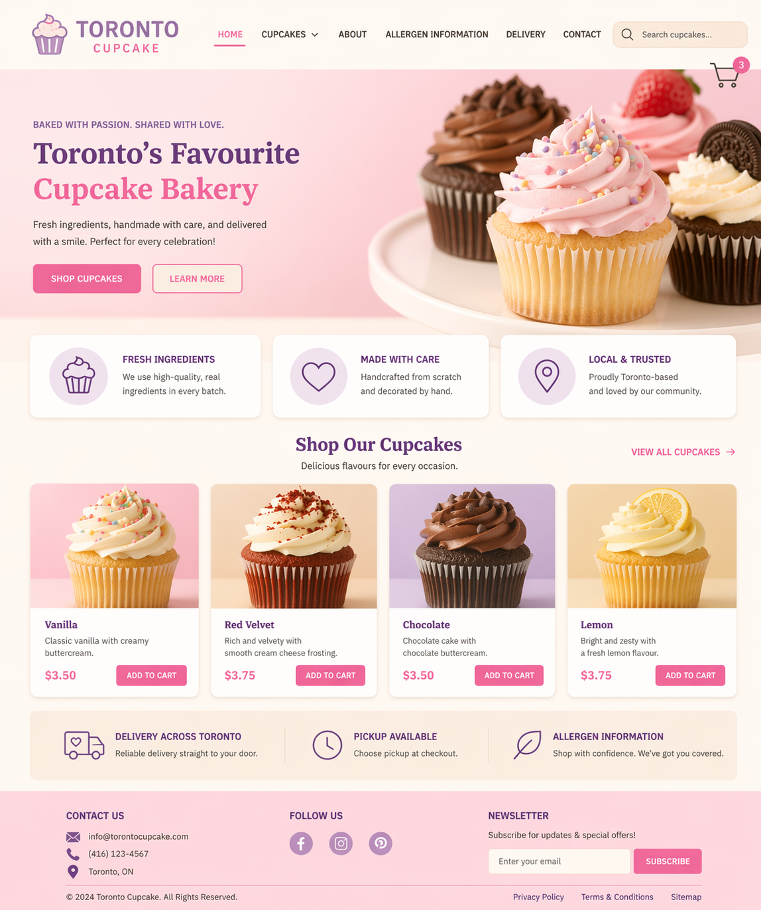
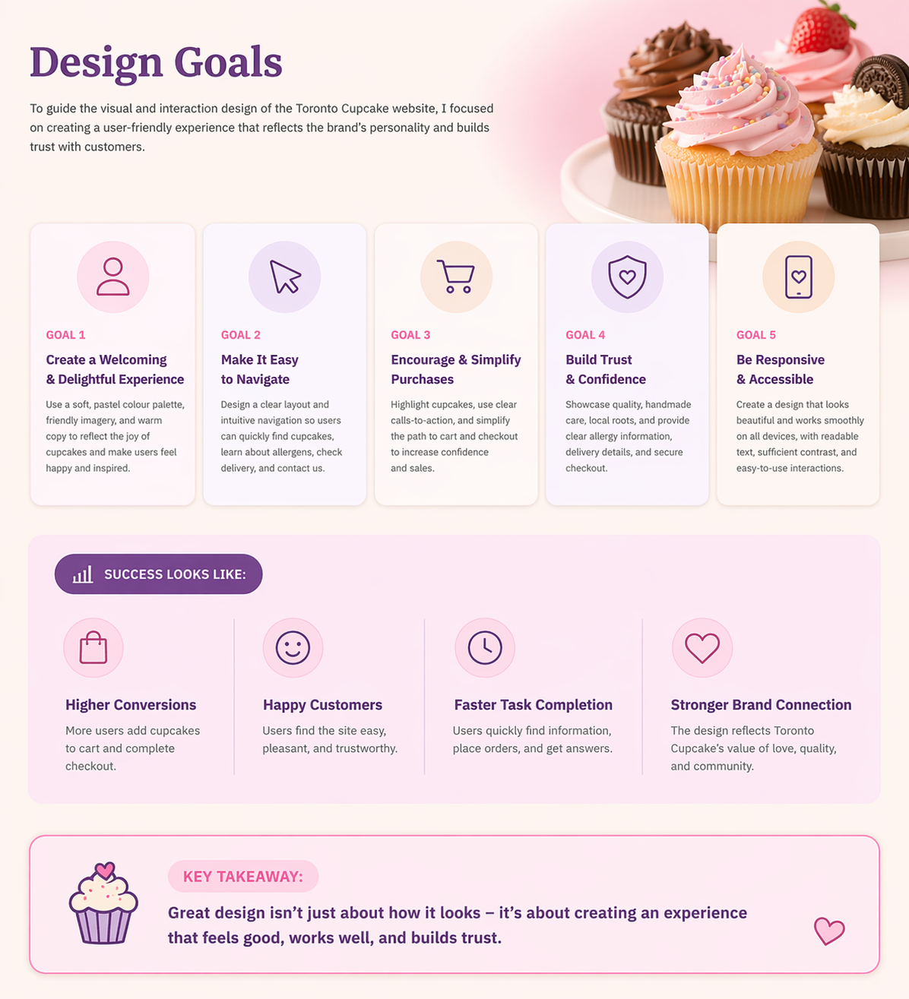
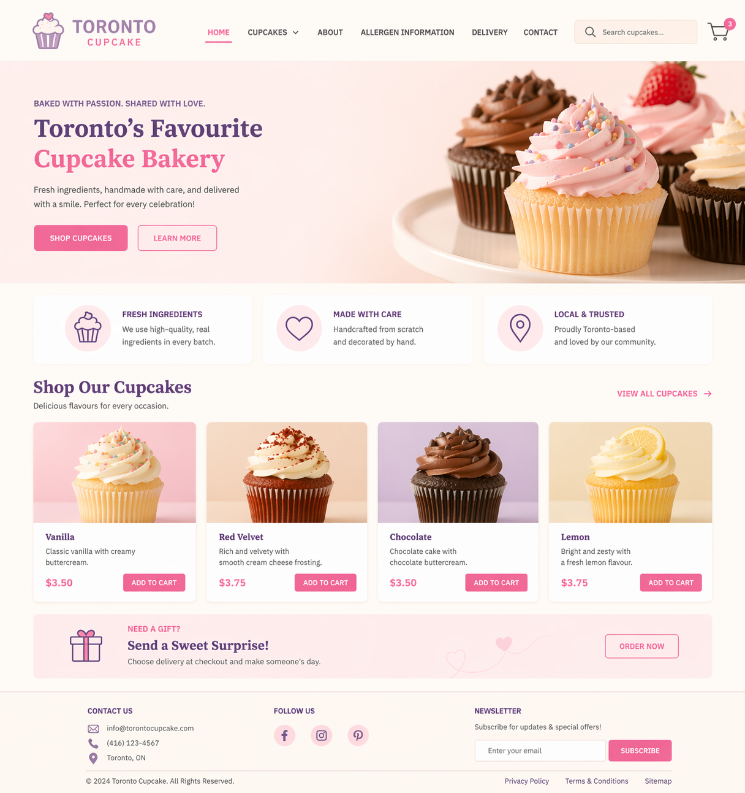
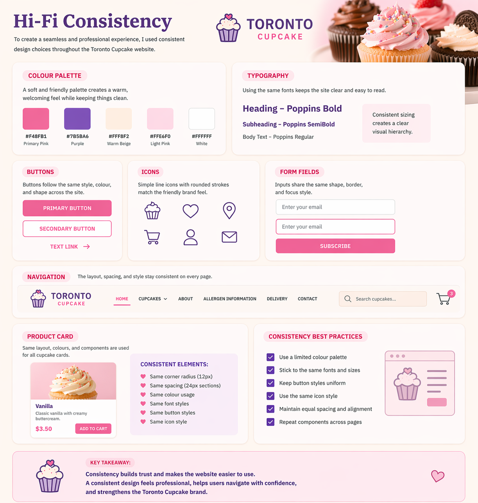
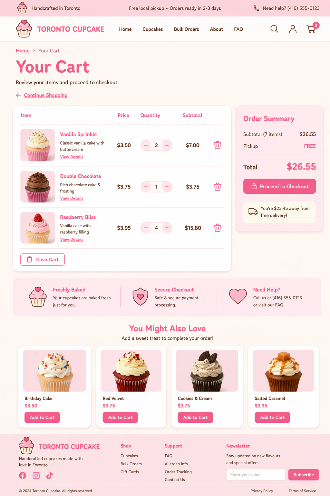
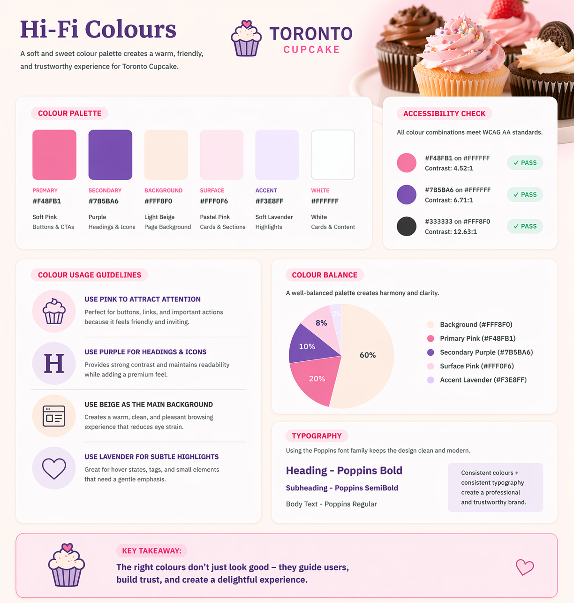
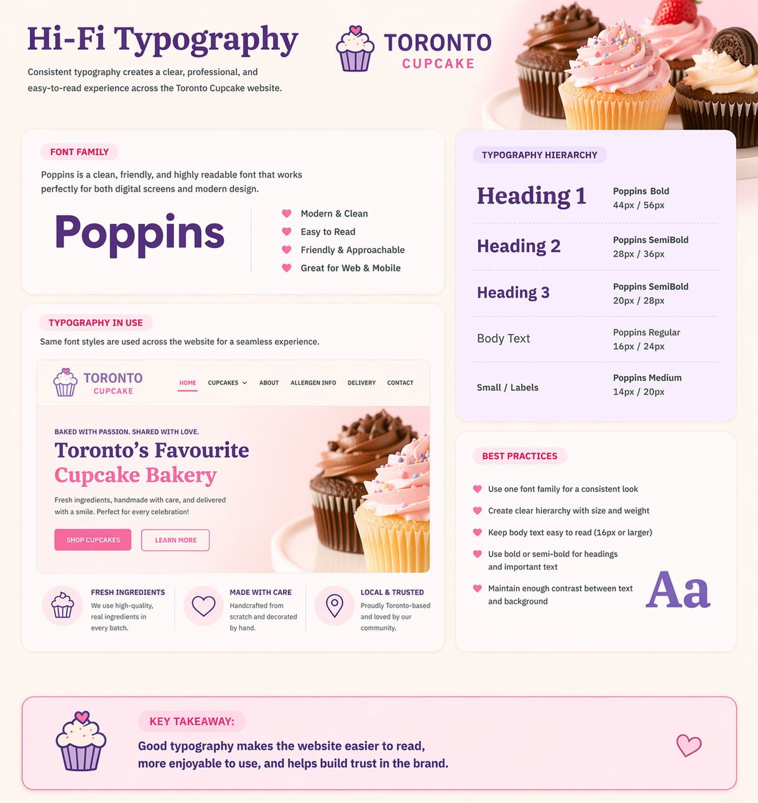
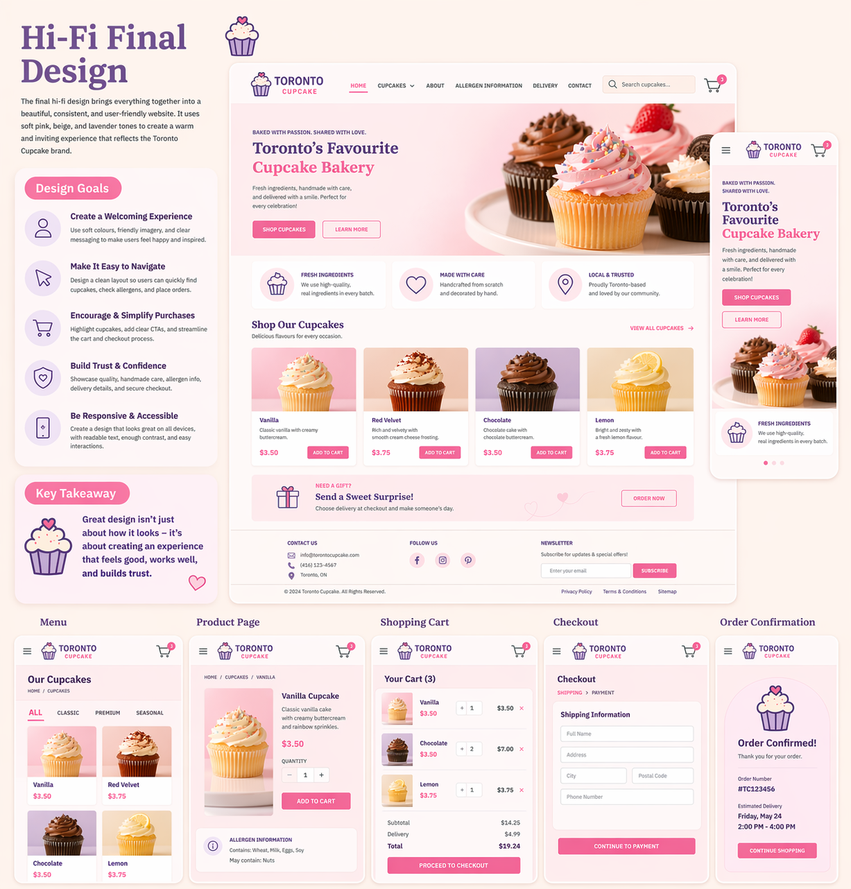

# High-Fidelity Prototypes of Toronto Cupcake Redesign 📕  

## Project Overview

This project focuses on redesigning the Toronto Cupcake website with an emphasis on improving usability, visual clarity, and consistency. The high-fidelity (Hi-Fi) prototypes represent the final stage of the design process, where all visual elements such as colors, typography, spacing, and layout are fully developed. Unlike low-fidelity wireframes, these prototypes closely resemble the final product and allow for a more realistic evaluation of the user experience.

The redesign aims to create a clean, modern, and user-friendly interface that aligns with user expectations and industry standards. By applying usability heuristics and thoughtful visual design, the website becomes easier to navigate and more engaging for users.

!!! info "Hi-Fi Prototypes"
    High-fidelity prototypes include final visual elements such as colors, typography, spacing, and interactive components.

!!! warning "Visual Design Impact"
    Poor visual hierarchy or inconsistent styling can reduce readability and negatively affect user trust and engagement.

---

## Design Goals

The main goal of this redesign is to simplify the user experience while maintaining a visually appealing interface. The original website contained cluttered content and inconsistent layouts, which made it difficult for users to focus on key tasks. In the redesigned version, unnecessary elements are removed and replaced with a cleaner structure that improves readability and navigation.

Another important goal is to follow standard web design patterns so that users can interact with the website intuitively. Important information such as pricing, allergens, and order status is made more visible, allowing users to complete tasks more efficiently. Overall, the design focuses on creating a balance between aesthetics and functionality.

---

## Heuristics Applied

### 1. Aesthetic and Minimalist Design

The original Toronto Cupcake website included excessive and distracting content that did not support user goals. For example, certain sections such as tariffs and repeated logos took up valuable space while adding little value. This clutter made it harder for users to find relevant information and navigate the site effectively.

In the redesigned version, a minimalist approach is applied by removing unnecessary elements and focusing only on essential content. This creates a cleaner layout that improves readability and helps users concentrate on important actions such as browsing products or placing orders. A simplified design also enhances the overall visual appeal of the website.

---

### 2. Consistency and Standards

One of the major issues in the original design was the lack of consistency with standard web conventions. For example, the logo did not link back to the homepage, the cart was displayed as a simple text link, and the navigation structure was not intuitive. These inconsistencies made it harder for users to complete tasks because the interface did not behave as expected.

The redesigned interface follows common design standards to improve usability. The logo is now clickable and returns users to the homepage, the cart is displayed as a recognizable icon, and the navigation layout is simplified. These changes create a more predictable and user-friendly experience, allowing users to interact with the website more confidently.

---

### 3. Visibility of System Status

In the original website, users had difficulty checking the status of their cart while browsing products. Since the cart was located on a separate page, users had to interrupt their browsing process to review their selections. This created unnecessary friction and reduced efficiency.

The redesigned version improves visibility by introducing a cart icon with a real-time item count. In addition, a floating cart feature allows users to quickly view their selections without leaving the current page. This enhancement provides immediate feedback and helps users stay informed about their actions throughout the browsing process.

!!! note
    Improving system visibility reduces user frustration and creates a smoother shopping experience.

---

## Colour Palette

The redesigned website uses a soft and elegant color palette that reflects the brand identity while maintaining readability. The primary color (light cream) creates a clean background, while the secondary color (deep red) adds contrast and highlights important elements such as buttons and headings. A tertiary green color is used sparingly for accents, ensuring that it does not distract from the main content.

This color combination improves visual hierarchy and guides the user’s attention to key areas of the page. At the same time, the use of black for text ensures strong readability across all sections.

---

## Typography

Typography plays an important role in creating a professional and readable interface. The redesign uses Source Serif Semi Bold for main headings and Source Serif Italic for subheadings, which adds a sense of elegance and hierarchy. Body text is displayed in Arial, a clean and simple font that improves readability on different screen sizes.

By using consistent typography throughout the website, the design becomes more cohesive and easier to scan. Clear font hierarchy also helps users quickly identify important information and navigate content more effectively.

---

## Conclusion

The high-fidelity prototypes demonstrate how the redesigned Toronto Cupcake website improves both usability and visual design. By applying usability heuristics such as minimalism, consistency, and visibility of system status, the new design creates a more intuitive and efficient user experience.

Overall, the redesign transforms the website into a cleaner, more modern, and user-friendly platform. The improved layout, clearer navigation, and enhanced visual hierarchy help users complete tasks with less effort, resulting in a more satisfying and effective interaction with the site.

!!! note
    A strong visual design combined with good usability principles leads to higher user satisfaction and better overall performance.
