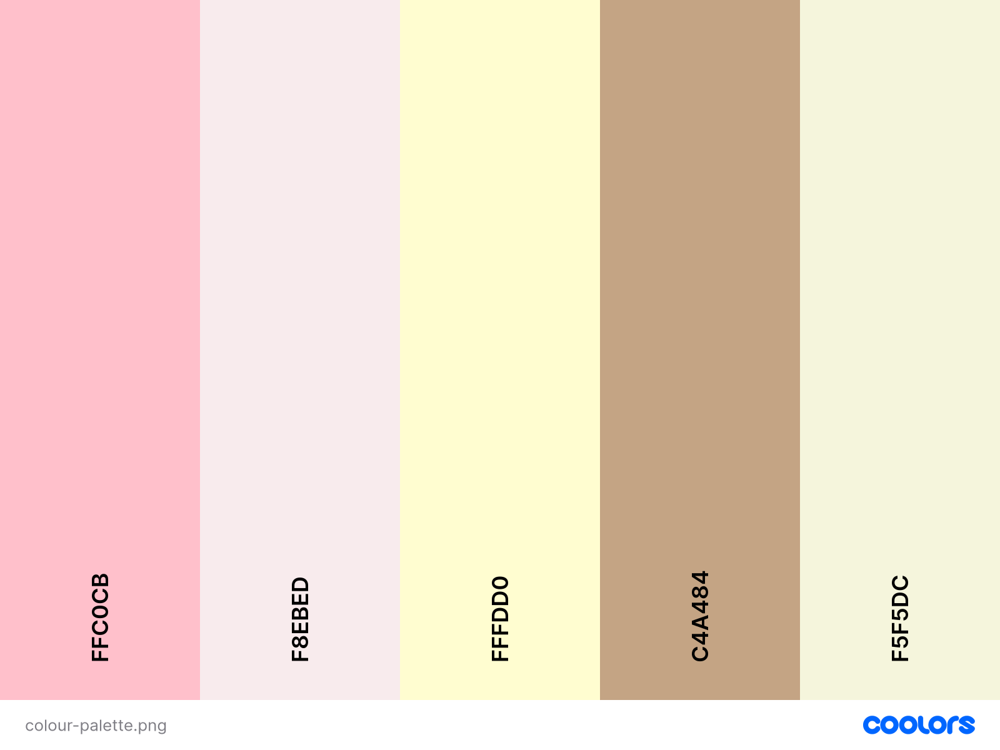
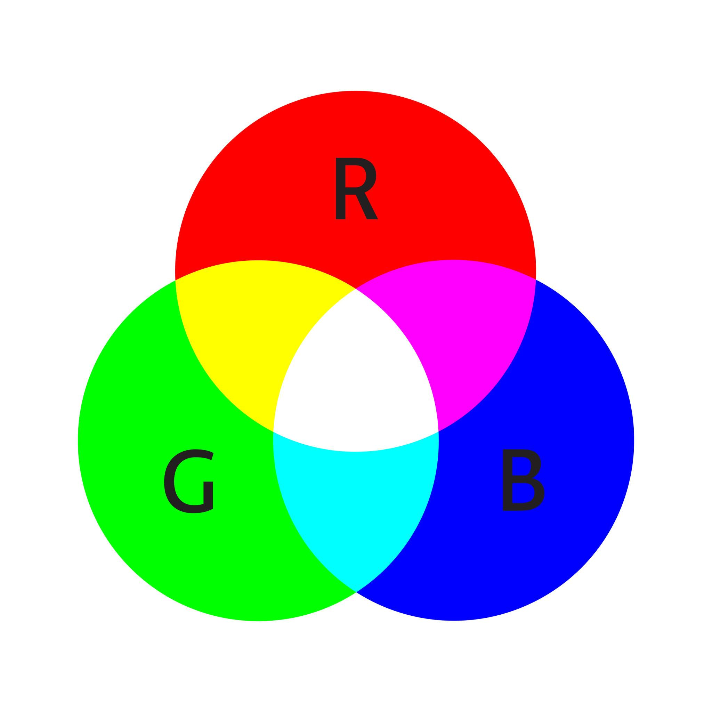
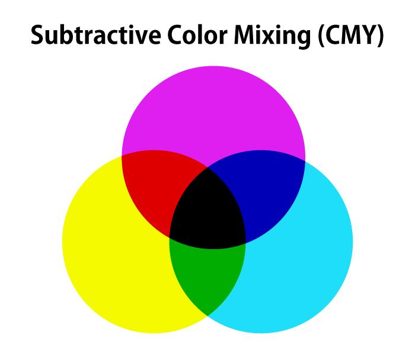
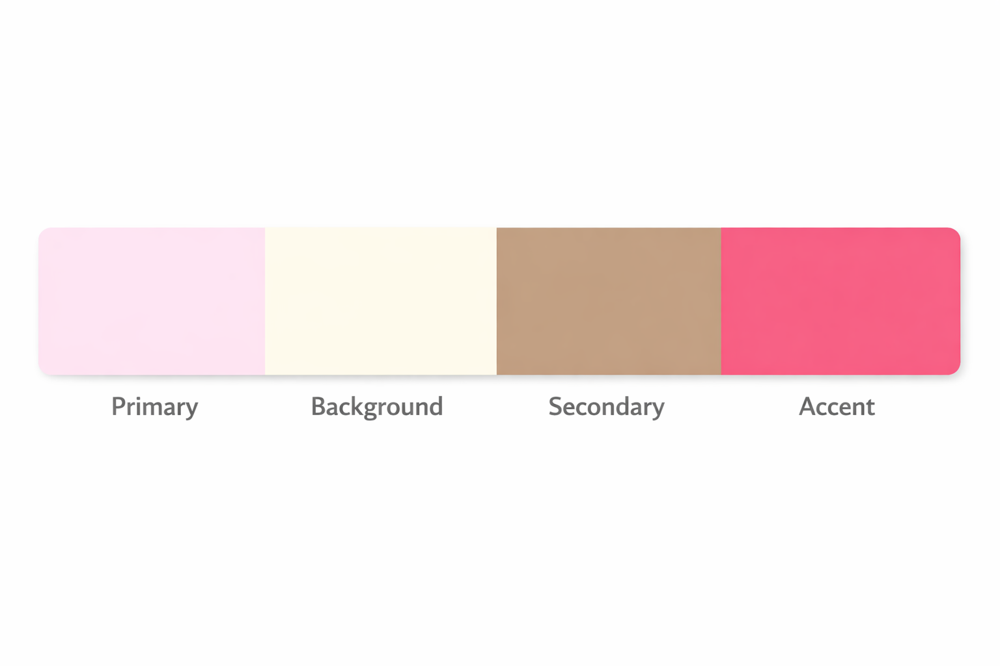
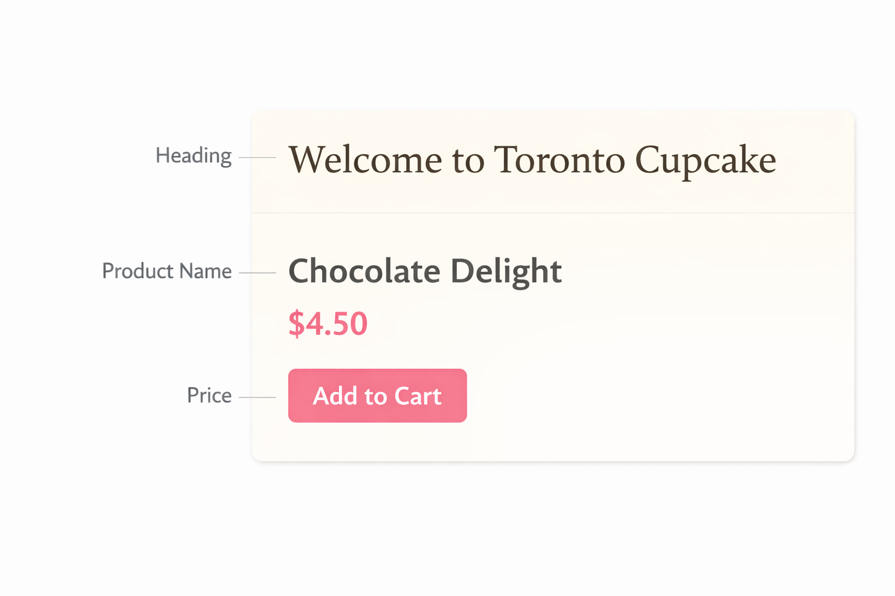
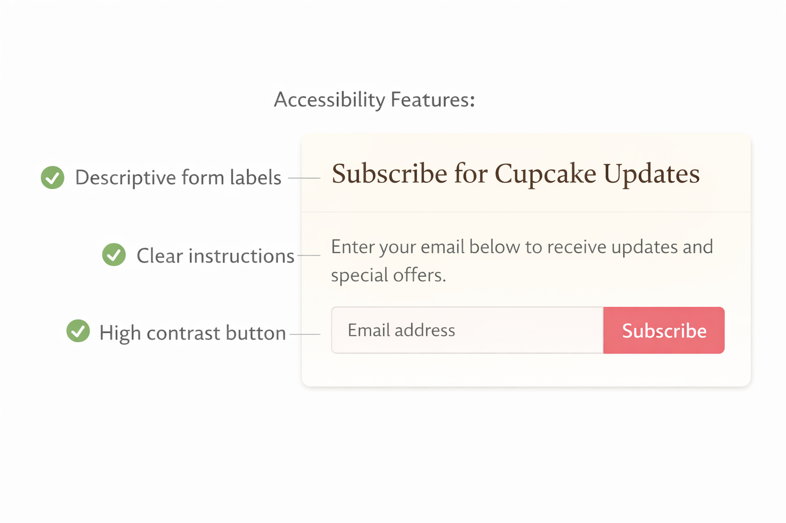
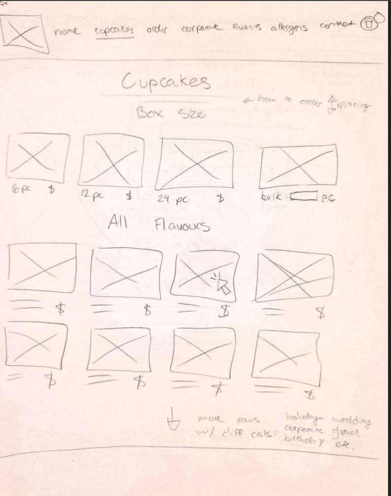

# Colour and Typography – Toronto Cupcake 🎨

This section explains how colour and typography are applied in the Toronto Cupcake website redesign. The goal is to create a design that is visually appealing, easy to read, and accessible for all users. These design elements play a key role in shaping how users interact with the interface, understand content, and complete tasks efficiently.

---

!!! info "Design Goal"
    The redesigned Toronto Cupcake website uses colour and typography to improve navigation, readability, and overall user experience while maintaining a premium and elegant brand identity.

---

## Colour Models in Design

### Additive Colour Model (Digital Screens)

The Toronto Cupcake website is a digital platform, so it uses the **additive colour model (RGB)**. This model starts with white light and builds colours by combining red, green, and blue. It is the standard model used for screens and digital interfaces.

Understanding RGB is important when designing UI elements such as buttons, backgrounds, and images, because it ensures that colours appear correctly across different devices. Proper use of this model helps maintain consistency in visual design and prevents unexpected colour differences.

---

### Subtractive Colour Model (Print Context)

Although the website itself is digital, branding materials such as packaging and promotional items may use the **subtractive colour model (CMY)**. This model starts with the absence of light and creates colours by combining cyan, magenta, and yellow.

This distinction is important because using the wrong colour model can result in inconsistent branding between digital and physical materials.

---

!!! warning "Design Consistency"
    Using the wrong colour model can cause inconsistencies between digital screens and printed materials. This is important for maintaining a consistent Toronto Cupcake brand.

---

## Colour Usage in the Redesign

The redesigned website uses colour to support a clean and premium visual style that aligns with the expectations of a gourmet cupcake brand. Soft pastel tones are used to create a warm and inviting bakery aesthetic, while neutral backgrounds help reduce visual clutter and improve readability.

Accent colours are applied strategically to highlight key actions such as “Add to Cart” buttons and important navigation elements. This use of contrast helps guide user attention and makes it easier for users to understand what actions to take next.

Overall, colour is used not just for decoration, but as a functional tool to improve visual hierarchy, usability, and user flow.

---

## Typography in the Redesign

Typography is designed to improve readability and create a professional and consistent appearance across the website. Clean and modern fonts are selected to ensure that text is easy to read on all devices.

Headings are larger and more prominent to establish a clear hierarchy, while body text is kept simple and well-spaced to support readability. Proper spacing between lines and sections helps users scan content quickly and reduces cognitive load.

These improvements make it easier for users to understand product information, compare options, and complete tasks without confusion.

---

!!! info "UX Improvement"
    Strong typography helps users quickly scan product listings, read descriptions, and understand important information without confusion.

---

## Accessibility and Colour

Accessibility is a key part of the redesign, ensuring that the website can be used by a wide range of users, including those with visual impairments.

!!! danger "Do NOT Use Colour Alone"
    Colour is never used as the only way to indicate meaning (such as errors, success, or warnings). Users with colour vision deficiencies may not be able to distinguish these differences.

Instead of relying only on colour, the design combines icons, text labels, and clear messaging to communicate meaning effectively. For example, error messages include both text and icons, and allergen warnings use symbols along with written descriptions.

This approach improves usability and ensures that important information is accessible to all users.

---

## Application to Toronto Cupcake Features

These design principles are applied across key areas of the website to improve overall usability and user experience. On product pages, improved typography and spacing make it easier to read product names and descriptions. In the cart and checkout process, clear labels and visual feedback help users stay in control of their actions.

Allergen information is presented using both icons and text to ensure clarity and safety, while consistent colour usage in navigation helps users understand the structure of the website and move between sections confidently.

---

## Summary

The redesign uses the RGB colour model for digital consistency and applies typography principles to improve readability and structure. Colour is used to enhance the interface and guide user attention, but it does not replace clarity or usability.

Accessibility is improved by combining colour with text and icons, ensuring that all users can understand and interact with the website effectively.

!!! info "Final Insight"
    By combining effective colour usage and strong typography, the Toronto Cupcake redesign creates a more accessible, professional, and user-friendly experience.
